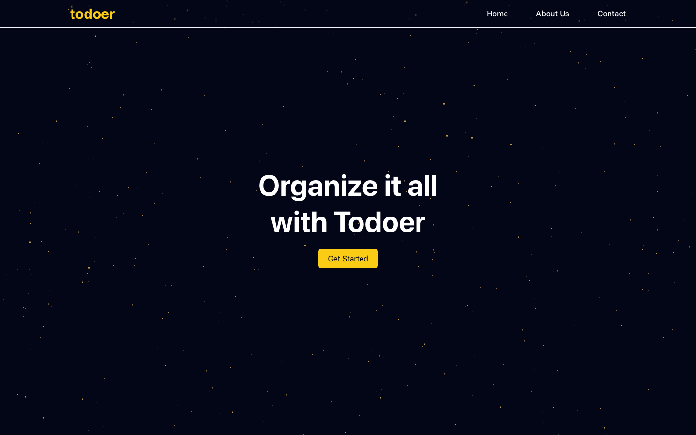

# Todoer

A full-stack to-do app on the MERN stack. Users sign up, sign in and keep their own task list with due dates and completion status. Built in September 2023.

**Live frontend:** https://todo-mern-alpha.vercel.app. The Express API was hosted separately and may be offline, so sign-in can fail on the live site.



## Status

Complete for its scope.

## What it does

- Registers and signs in users with hashed passwords and JWT access tokens.
- Creates, edits and deletes tasks, each with a title and a due date picked from a calendar.
- Marks tasks complete or incomplete.
- Shows each user only their own tasks. Every task route checks the JWT first.

## API

| Method and path | Purpose |
| --- | --- |
| `POST /api/users/register` | Create an account |
| `POST /api/users/login` | Sign in and get a JWT |
| `GET /api/users/current` | Get the signed-in user |
| `GET /api/todo-list` | List the user's tasks |
| `POST /api/todo-list` | Create a task |
| `GET /api/todo-list/:id` | Get one task |
| `PUT /api/todo-list/:id` | Update a task |
| `PUT /api/todo-list/:id/update-completion` | Toggle completion |
| `DELETE /api/todo-list/:id` | Delete a task |

## Tech stack

- **Frontend:** React, React Router, Vite, Tailwind CSS and MUI date pickers
- **Backend:** Express, Mongoose and MongoDB, with JWT auth
- **Hosting:** Netlify and Vercel for the frontend, Render for the API

## Run it locally

You need Node.js 18 or later and a MongoDB database.

1. Install the dependencies:

   ```bash
   npm install
   ```

2. Create `.env`:

   ```bash
   VITE_CONNECTION_STRING=       # MongoDB connection string
   VITE_ACCESS_TOKEN_SECRET=     # any long random string
   VITE_PORT=5001                # port for the API
   VITE_REACT_APP_API_URL=http://localhost:5001
   ```

3. Start the API and the frontend in two terminals:

   ```bash
   node api/server.js
   npm run dev
   ```

The API only accepts requests from the origins listed in `api/server.js`. Add `http://localhost:5173` there for local development.
